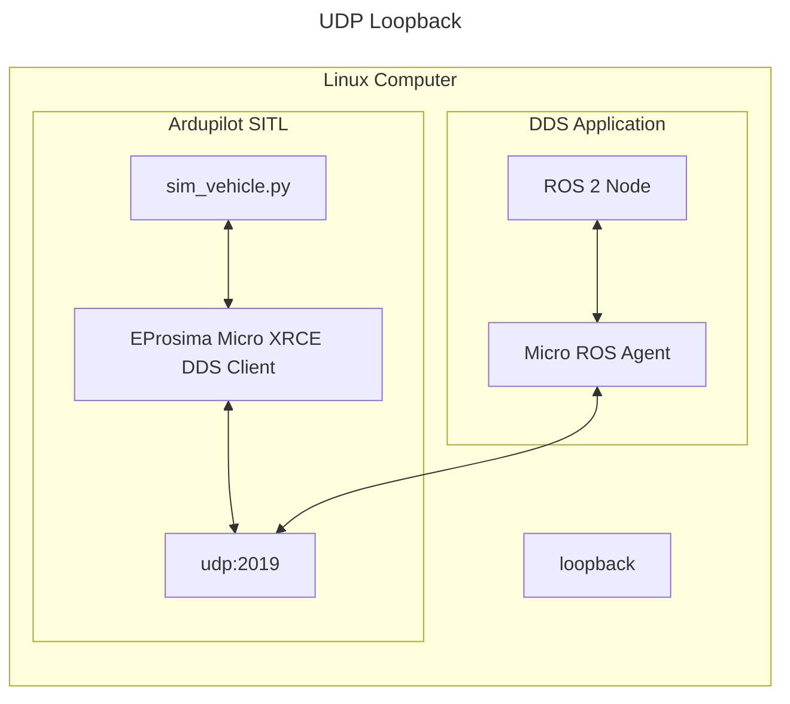

## Navigation in Ardupilot ROS2-gazebo drone

Let’s quickly understand what Nav2 is and why we need it. <br>

And before we get started, let’s just be clear on the terms we are going to use. When I write about Navigation, Navigation 2, Nav2, well this is all the same, I am writing about the Navigation 2 stack in ROS2 (also if I write ROS I also mean ROS2). <br>

So, why do we need Nav2 in the first place? Well, as you probably already know, ROS is a great framework that allows you to develop new robotics applications in no time. You get a lot of “plumbing” already done for you, a huge set of plug & play libraries, a community to help you, etc. <br>

Now, how do you go from knowing the ROS basics, to successfully implementing navigation for a mobile robot? This is not trivial at all, and fortunately, the Navigation 2 stack was developed just for that. The “stack” is a collection of packages that have been developed with one goal in mind. <br>

And what is this goal? The main goal is to make a robot move from point A to point B, in a safe way. So, basically, to find a path that allows the robot to reach the destination, while making sure that it will not collide with other robots, with people, and obstacles. <br>

## Steps
To achieve this, we will do a 2 step process:
1. We will create a map of the environment using `Cartographer`.
2. We will make the robot navigate using this map – with the Navigation functionalities and tools.

## 1. Cartographer running with LiDAR on copter
This simulation has an Iris copter equipped with a 3D LiDAR in a maze world. To launch rviz and gazebo, run:
```
ros2 launch ardupilot_ros cartographer.launch.py
```

## 2. Obstacle avoidance using Cartographer and Nav2
Using the same simulation as before, the nav2 node can be launched to control the copter once it is in the air.
Launch the simulation:
```
ros2 launch ardupilot_ros navigation.launch.py
```
You may now navigate while mapping using the Nav2 Goal tool in RVIZ!

## DDS/micro-Ros
Ardupilot contains the DDS Client library, which can run as SITL. Then, the DDS application runs a ROS 2 node, an eProsima Integration Service, and the MicroXRCE Agent. The two systems communicate over serial or UDP. <br>


## Info
1. TF frames of the simulation.


2. rqt_graph


